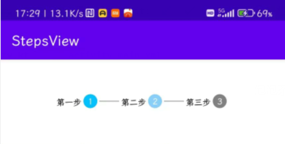
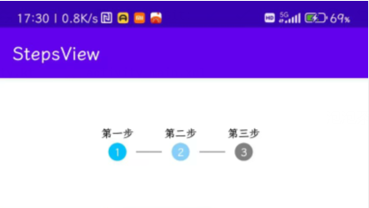
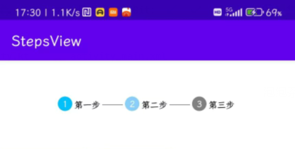
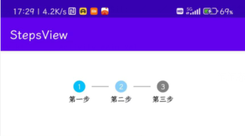

# [StepsView(步骤控件)](https://github.com/SilverIceKey/StepsView)  

[](https://jitpack.io/#SilverIceKey/StepsView)

本控件发布到jitpack仓库  

## 控件集成  

添加仓库

```gradle
allprojects {
        repositories {
            ...
            maven { url 'https://jitpack.io' }
        }
    }
```

添加依赖  

```gradle
dependencies {
    implementation 'com.github.SilverIceKey:StepsView:Tag'
}
```

## 样图

- 步骤标题在左边

- 步骤标题在上边

- 步骤标题在右边

- 步骤标题在下边


## 使用说明

```xml
<com.sk.steps_view.StepsView
    android:id="@+id/steps_view"
    android:layout_width="match_parent"
    android:layout_height="wrap_content" />
```

需要创建内容列表```List<StepItem>```之后调用```setSteps(List<StepItem> steps)```进行设置  

```stepTo(int step)``` 跳转指定步骤

```stepToNext()``` 下一步

```stepToPrevious()``` 下一步

可以在xml中设置的参数如下:  

|属性名称|描述|
|---|---|
|step_padding|步骤数的内边距|
|step_background_done|已完成的步骤数的背景|
|step_text_color_done|已完成的步骤数的文字颜色|
|step_text_size_done|已完成的步骤数的文字大小|
|step_background_undo|未进行的步骤数的背景|
|step_text_color_undo|未进行的步骤数的文字颜色|
|step_text_size_undo|未进行的步骤数的文字大小|
|step_background_doing|正在进行中的步骤数的背景|
|step_text_color_doing|正在进行中的步骤数的文字颜色|
|step_text_size_doing|正在进行中的步骤数的文字大小|
|step_connect_line_color|步骤连接线的颜色|
|step_connect_line_width|步骤连接线的宽度|
|step_connect_line_height|步骤连接线的高度|
|step_name_text_size|步骤标题的文字大小|
|step_name_text_color|步骤标题的文字颜色|
|step_and_connect_line_padding|步骤数和步骤连接线的间距|
|step_and_name_padding|步骤数和步骤标题的间距|
|step_name_to_no_gravity|步骤标题相对于步骤数的位置|
